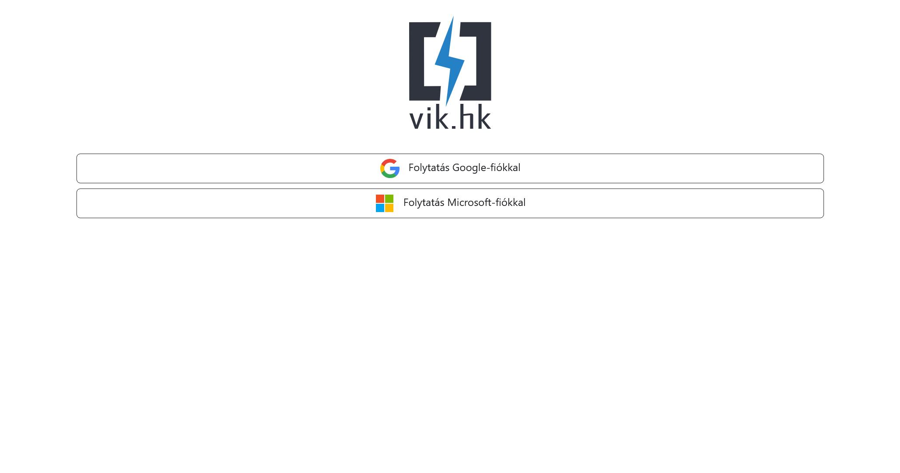

# HK Világautomata

A Proposal & Voting System for the Student Council of BME VIK (VIK HK).

## Configuration

Create a `.env` file based on the example provided in `.env.example`.
You will need to set the following environment variables: `DATABASE_URL`, `GOOGLE_CLIENT_ID`, `GOOGLE_CLIENT_SECRET`.

## Build & Run

Install the project's dependencies via:

```bash
npm install
```

Create the database by running the initial migration:

```bash
npx prisma migrate dev --name init
```

During development, the easiest way to run the app is to enter the following command which will also open up the web app in a browser window:

```bash
npm run dev -- --open
```

## Screenshots

### Login Screen




### Home Screen


### Proposals Screen


### Users Screen


